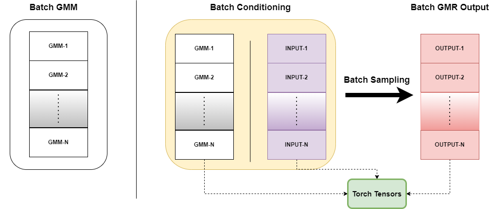

***
batch-gmr
***

Description
-----------
This repo contains a simple implementation of batch Gaussian Mixture Regression (GMR) with PyTorch. The implementation is entirely based on the Alexander Fabisch's `gmr` library, which is a Python library for Gaussian Mixture Regression (GMR) and Gaussian Mixture Models (GMM). The library is available [here](https://github.com/AlexanderFabisch/gmr/). I basically reimplemented each `gmr` function with PyTorch to support parallel computations.

The main motivation behind this implementation is to enable parallel GMR for multiple GMMs. In a robotics research project, we basically had to rollout several hundereds of slightly different GMM based robot policies in parallel in simulation. The `gmr` library was not designed for such parallel GMR rollouts, and the sequential GMR and multi-threading alternatives were too slow for our needs. This implementation was a simple PyTorch-based solution to that problem.

_Note: I am fairly convinved this will not be useful to most people. But if you are in a similar situation as we once were, this might be useful for you._

Installation
------------

Install `batch-gmr` from source:

.. code-block:: bash

    git clone https://github.com/acl21/batch-gmr.git
    cd batch-gmr
    pip install -e .
    # or python setup.py install 

Example
-------

Estimate multiple GMMs from multiple datasets, using `gmr`'s `GMM` class:
.. code-block:: python

    import numpy as np
    from gmr import GMM
    from time import time

    # Your dataset as a numpy array
    data1 = np.random.randn(100, 4)
    data2 = np.random.randn(100, 4)
    data3 = np.random.randn(100, 4)
    data4 = np.random.randn(100, 4)

    # Create multiple GMM objects
    gmm1 = GMM(n_components=3)
    gmm2 = GMM(n_components=3)
    gmm3 = GMM(n_components=3)
    gmm4 = GMM(n_components=3)

    # Fit the GMMs to the data
    gmm1.from_samples(data1)
    gmm2.from_samples(data2)
    gmm3.from_samples(data3)
    gmm4.from_samples(data4)

    # Use batch-gmr for parallel GMR
    from batch_gmr import BatchGMM

    gmm_list = [gmm1, gmm2, gmm3, gmm4] * 1000
    device = "cuda:0"
    b_gmm = BatchGMM(gmm_list=gmm_list, device=device)
    b_x = np.random.randn(len(gmm_list), 2)
    start = time()
    b_cgmm = b_gmm.condition([0, 1], b_x)
    b_out = b_cgmm.one_sample_confidence_region(alpha=0.7)
    end = time()
    print("Batch GMM time: ", end - start)

    # Use GMR for sequential GMR
    start = time()
    for idx, gmm in enumerate(gmm_list):
        gmr = gmm.condition([0, 1], b_x[idx])
        out = gmr.sample_confidence_region(n_samples=1, alpha=0.7)
    end = time()
    print("Sequential GMM time: ", end - start)
